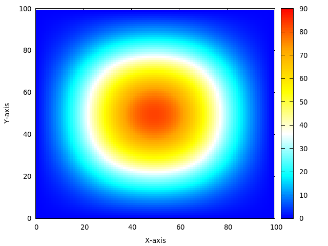

# Heat-Diffusion-Simulation (Προσομοίωση διάχυσης θερμότητας)

Αυτό το αποθετήριο περιλαμβάνει μια προσομοίωση διάχυσης θερμότητας χρησιμοποιώντας δύο διαφορετικές προσεγγίσεις: σειριακή και παράλληλη με OpenMP και MPI. Ο κώδικας εκτελείται σε επεξεργαστές πολλαπλών πυρήνων και διαδικτυακά περιβάλλοντα για ταχύτερους υπολογισμούς.

## Περιγραφή του Προβλήματος

Η διάχυση θερμότητας είναι μια φυσική διεργασία που περιγράφει τη μεταφορά θερμικής ενέργειας μέσω αγωγής. Η εξίσωση διάχυσης θερμότητας περιγράφει αυτή τη διαδικασία μαθηματικά:

Η εξίσωση διάχυσης θερμότητας περιγράφεται μαθηματικά ως:

\[ \frac{\partial u}{\partial t} = \alpha \nabla^2 u \]

όπου:
- \( u \) είναι η θερμοκρασία,
- \( t \) είναι ο χρόνος,
- \( \alpha \) είναι ο συντελεστής θερμικής διάχυσης,
- \( \nabla^2 \) είναι ο τελεστής Λαπλασιανού.

Αυτή η εξίσωση περιγράφει τον ρυθμό μεταβολής της θερμοκρασίας \( u \) σε σχέση με τον χρόνο \( t \), ο οποίος εξαρτάται από τη θερμική διάχυση στο χώρο, καθώς περιγράφει τη μεταφορά θερμότητας μέσω αγωγής. H προσομοίωση χρησιμοποιεί τη μέθοδο πεπερασμένων διαφορών για την επίλυση αυτής της εξίσωσης σε ένα 2D πλέγμα.

## Αποτέλεσμα Προσομοίωσης



## Έναρξη

1. **Προαπαιτήσεις:**
    - Ένας μεταγλωττιστής C (π.χ., GCC, MPICC)
    - Βιβλιοθήκη OpenMP (συνήθως συμπεριλαμβάνεται στους περισσότερους σύγχρονους μεταγλωττιστές)
    - Βιβλιοθήκη MPI (Message Passing Interface)

2. **Κλωνοποίηση του αποθετηρίου:**

    ```bash
    git clone https://github.com/theodorostaloumtzis/Heat-Diffusion-Simulation.git
    ```

## Μεταγλώττιση και Εκτέλεση της Προσομοίωσης Διάχυσης Θερμότητας

1. **Μετακίνηση στον κατάλογο του έργου:**

    ```bash
    cd Heat-Diffusion-Simulation
    ```

2. **Μεταγλώττιση του κώδικα:**

    Για τον σειριακό κώδικα:
    ```bash
    gcc -o serial_sim serial_sim.c -lm -Wall
    ```

    Για τον κώδικα με OpenMP:
    ```bash
    gcc -o parallel_sim_omp parallel_sim_omp.c -lm -fopenmp -Wall
    ```

    Για τον κώδικα με MPI:
    ```bash
    mpicc -o parallel_sim_mpi parallel_sim_mpi.c -lm -lmpi -Wall
    ```

    Για τον υβριδικό κώδικα (MPI + OpenMP):
    ```bash
    mpicc -o parallel_sim_hybrid parallel_sim_hybrid.c -lm -fopenmp -lmpi -Wall
    ```

    - **Επεξήγηση σημαιών:**
        - `-o serial_sim`, `-o parallel_sim_omp`, κλπ: Ορίζει το όνομα του εκτελέσιμου αρχείου εξόδου.
        - `serial_sim.c`, `parallel_sim_omp.c`, κλπ: Καθορίζει το αρχείο του πηγαίου κώδικα.
        - `-lm`: Συνδέει τη βασική βιβλιοθήκη μαθηματικών.
        - `-fopenmp`: Ενεργοποιεί την υποστήριξη OpenMP για παράλληλη εκτέλεση (μόνο για τον κώδικα OpenMP).
        - `-lmpi`: Συνδέει τη βιβλιοθήκη MPI για παράλληλη εκτέλεση (μόνο για τον κώδικα MPI).
        - `-Wall`: Ενεργοποιεί τις προειδοποιήσεις του μεταγλωττιστή (προαιρετικό, αλλά συνιστάται).

3. **Εκτέλεση της προσομοίωσης:**

    Για τον σειριακό κώδικα:
    ```bash
    ./serial_sim
    ```

    Για τον κώδικα με OpenMP:
    ```bash
    ./parallel_sim_omp
    ```

    Για τον κώδικα με MPI:
    ```bash
    mpirun -n <number_of_processes> ./parallel_sim_mpi
    ```

    Για τον υβριδικό κώδικα (MPI + OpenMP):
    ```bash
    mpirun -n <number_of_processes> ./parallel_sim_hybrid
    ```

## Κατανόηση του Κώδικα

Η βασική λειτουργικότητα βρίσκεται στα αρχεία `serial_sim.c`, `parallel_sim_omp.c`, `parallel_sim_mpi.c` και `parallel_sim_hybrid.c`. Ακολουθεί μια ανάλυση των βασικών βημάτων:

* **Αρχικοποίηση:**
    - Ορίζονται οι διαστάσεις του πλέγματος και τα χρονικά βήματα για την προσομοίωση.
    - Διατίθεται μνήμη για το πλέγμα θερμοκρασίας.
    - Το πλέγμα αρχικοποιείται με κατάλληλες τιμές θερμοκρασίας.

* **Παραλληλοποίηση (για τον κώδικα OpenMP και MPI):**
    - Χρήση των οδηγιών OpenMP για τον παράλληλο υπολογισμό στον κώδικα OpenMP.
    - Χρήση της βιβλιοθήκης MPI για τον παράλληλο υπολογισμό στον κώδικα MPI.
    - Υβριδική χρήση και των δύο προσεγγίσεων για τον υβριδικό κώδικα.

* **Προσομοίωση Διάχυσης Θερμότητας:**
    - Ο κύκλος του κύριου προγράμματος επαναλαμβάνεται για τα χρονικά βήματα.
    - Μέσα σε κάθε χρονικό βήμα:
        - Η συνάρτηση `update` υπολογίζει νέες τιμές θερμοκρασίας για κάθε σημείο του πλέγματος με βάση τους γείτονές του και την εξίσωση διάχυσης θερμότητας.

* **Ολοκλήρωση:**
    - Απελευθερώνεται η μνήμη που έχει διατεθεί για το πλέγμα.

## Οδηγίες Δοκιμών και Αποτελεσμάτων

* Μετά την εκτέλεση της προσομοίωσης, τα αποτελέσματα θα αποθηκευτούν σε ένα αρχείο `heatmap.txt`.
* Μπορείτε να χρησιμοποιήσετε ένα εργαλείο οπτικοποίησης (π.χ., Gnuplot, Matplotlib) για να δημιουργήσετε γραφήματα από τα δεδομένα και να δείτε την εξέλιξη της θερμοκρασίας στο πλέγμα κατά τη διάρκεια της προσομοίωσης.

Αυτό το αποθετήριο προσφέρει έναν πλήρη κώδικα για την προσομοίωση διάχυσης θερμότητας σε διαφορετικά περιβάλλοντα εκτέλεσης, επιτρέποντας την εξέταση και την αξιολόγηση της απόδοσης σειριακών, παράλληλων και υβριδικών υλοποιήσεων.

## Συγγραφέας

Theodoros Taloumtzis ([https://github.com/theodorostaloumtzis](https://github.com/theodorostaloumtzis))
